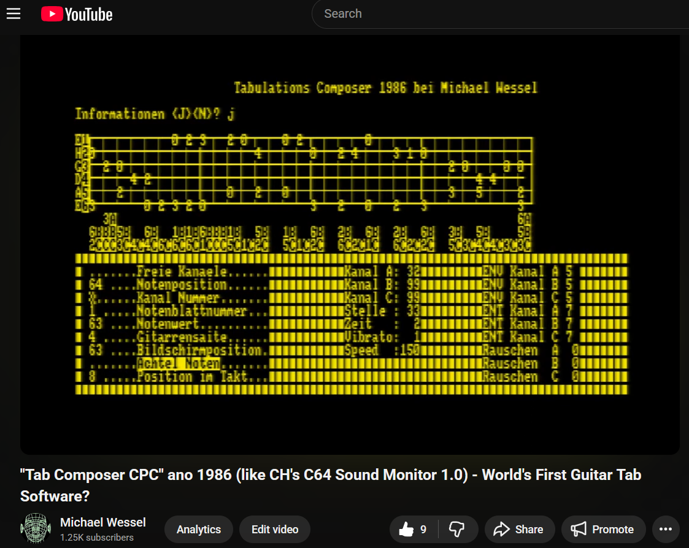

# tab-composer-cpc
The World's First (?) Tablature Composer Software - written in 1986 on an Amstrad CPC 464 

## Background & Purpose  

Having a keen interest in the history of computer music and music
composition software, I am researching what officially counts as the
**world's first tablature composer software.** 

Currently, the [Wikipedia page
https://en.wikipedia.org/wiki/Tablature_editor](https://en.wikipedia.org/wiki/Tablature_editor)
still lists "Tab Composer CPC" as the first such program (created in
1986), but the purpose of this Github repo and Wikipedia page entry is
to have a correct historical account - **so if you should know of any
earlier Tablature programs that fit the bill, please let me know, so
that the Wikipedia page can be corrected!**

This GitHub repo exists to provide evidence for the [claims
on the Wikipedia page.](https://en.wikipedia.org/wiki/Tablature_editor)

### Tab Composer CPC ("Tabulations Composer")

So here is my contender for "The World's First" such program -
"Tabulations Composer", written in 1986 on my [Amstrad CPC
464](https://en.wikipedia.org/wiki/Amstrad_CPC_464) in [Locomotive
BASIC 1.0](https://en.wikipedia.org/wiki/Locomotive_BASIC)  I
mainly wrote it to help me practice for my guitar lessons.

The [YT video](https://youtu.be/F6k4eq10DJg) demonstrates how to enter
a piece of music in Tablature notation using the WYSIWYG graphical
editor, and also [music playback.](https://youtu.be/F6k4eq10DJg?t=537)
Playback uses the CPC's 3-voice polyphonic [GI AY-3-8912 sound
chip](https://en.wikipedia.org/wiki/General_Instrument_AY-3-8910),
which was ubiquitous and quite capable for the time.

Here you can find [the Locomotive BASIC program
sources](src/tabcomp.txt), as well as [a DSK image](cpc/tabcomp.dsk)
that you can run in [a CPC Emulator.](http://www.winape.net/)

I used this program myself to create the music for my BASIC games back
in the day, e.g., the [6 highly polyphonic songs in
"MANIC".](https://youtu.be/_FTJe2Av1iw)

### Development & Historical Context

I started the project in spring 1986 and didn't own a disc drive yet,
so first versions of this rather large BASIC program were developed on
a purley cassette-based CPC system. This definitely required a lot of
patience.

I worked on this program for months, and transcribed [dozens of songs
from my guitar tab](https://youtu.be/_FTJe2Av1iw) book with it.

Guitar tablature creator software became available much later on the
PC AFAIK, and I had no inspiration for this program. I might have seen
[Chris Hülsbeck's 1986 "Sound Monitor
1.0"](https://www.c64-wiki.de/wiki/Soundmonitor) on the C64, which is
considered the first Sound Tracker program, but no Sound Tracker or
something remotely similar was available on the CPC at that time.

There were [other CPC music composition
programs](http://tacgr.emuunlim.com/interviews/daverogers.html)
available though (e.g., "The Music System" by Rainbird), some as early
as 1985 when the CPC 464 was released. However, these used standard
sheet music notation, not Tablature, and don't count as Sound Trackers
either.

### Publication Attempts 

It never got published - I made two attempts by sending it to the
editors of ["Happy
Computer"](https://archive.org/details/happycomputer-magazine), and
then to the [DMV Verlag](https://www.cpcwiki.eu/index.php/DMV), which
was the publisher of the premier CPC magazine in Germany back in the
day, ["Schneider CPC
International"](https://archive.org/search?query=subject%3A%22Schneider%2FAmstrad+CPC%2FPC+International%22). It
was rejected twice due to high complexity, poor documentation, and
being of interest to a limited readership / audience only. My publishing 
attempts probably started in September 1986,
and the latest letter of rejection arrived in February 1987 (from
DMV). [Here is the evidence.](evidence/dmv-letter-1.jpg)

[The documentation](evidence/) I wrote back in the day was a mess - I
didn't own a printer yet, and my handwriting was poor, so from that
point of view, it is not surprising that the program got rejected.

I [succeeded in selling / publishing other type-in programs for both
the CPC and later the Amiga
though](https://www.michael-wessel.info/anniversary.html) and
eventually made enough money so that I could afford the CPC disk drive
as well as an Amiga 500 with 1084 monitor back in the day.

### Reflections 

Even 35 years later, this is still a usable piece of software, and you
can see that entering a piece of Tab music doesn't take long! With a
bit of practice, as you can see in [the
video,](https://youtu.be/F6k4eq10DJg) it only takes about 5 minutes
for the first part of the Bach Minuet shown.

I definitely paid some attention to usability aspects as well and went
through a number of iterations. Correcting false notes is not very
convenient - but the idea was that "content" needed to be protected
from accidental deletions. A single left arrow key hence only deletes
the note immediately left to it, and does not go back further,
potentially deleting more stuff by accident (there was no
UNDO). Hence, the special "correction string" at the top was used to
manaveour the cursor back / to the left.  Definitely not very
convenient - I'd implement that differently today. However, note
correction is rarely needed anyway.

### The Evidence

My letter including the hand-written program documentation to, and
response from, the ["DMV
Verlag"](https://www.cpcwiki.eu/index.php/DMV) is presented in [the
`evidence/` folder.](evidence/)
