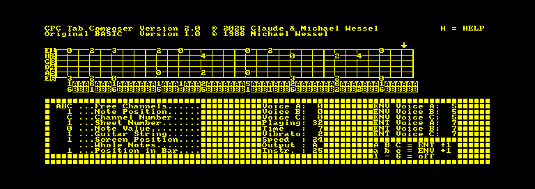
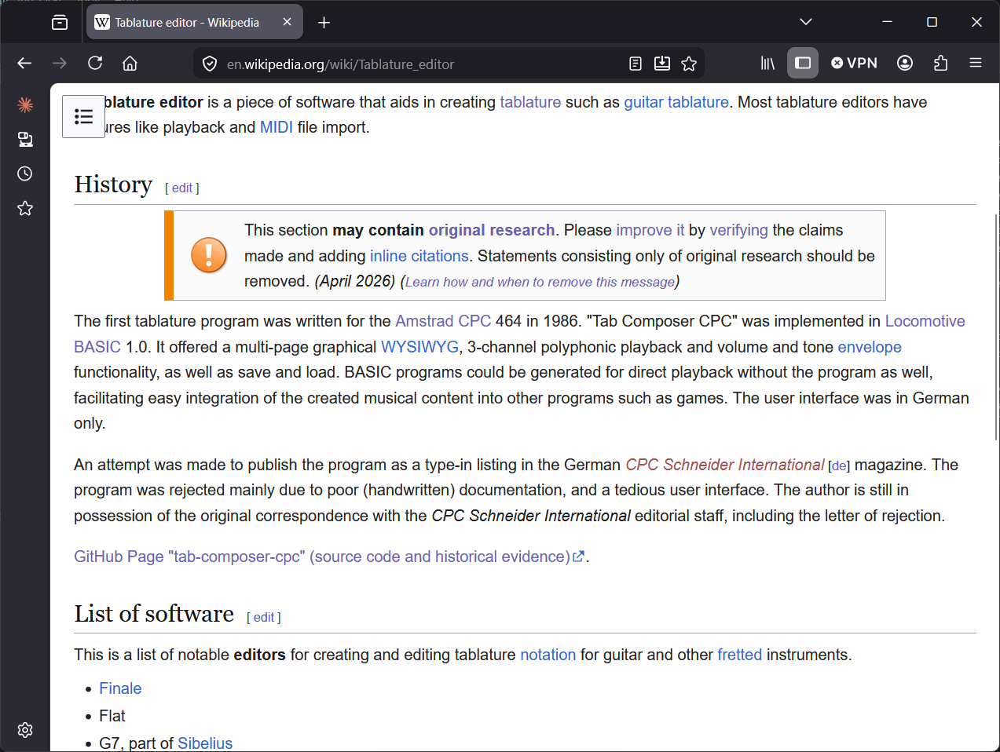
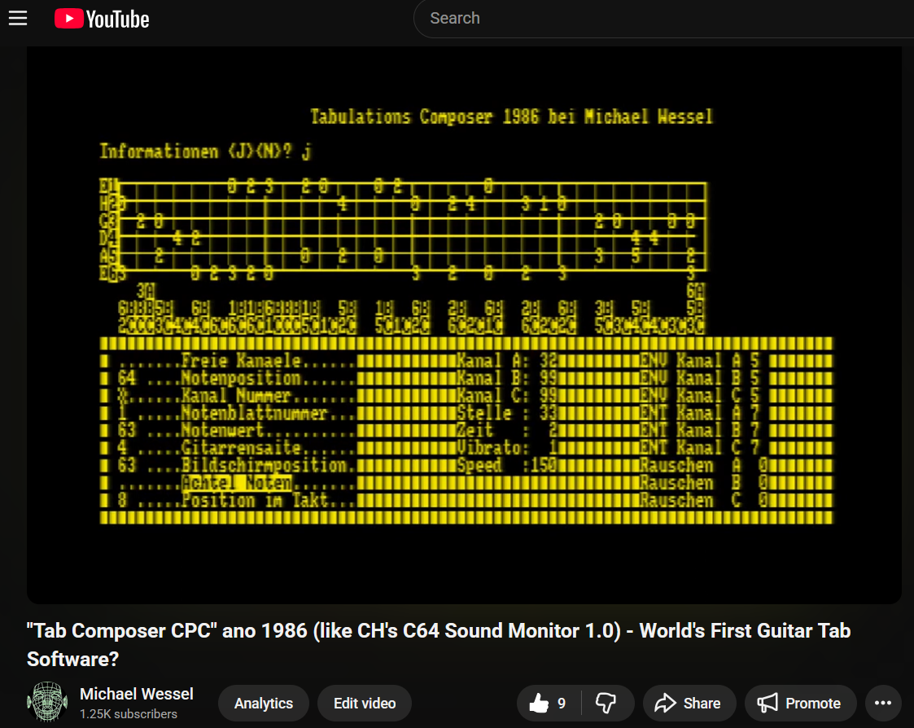
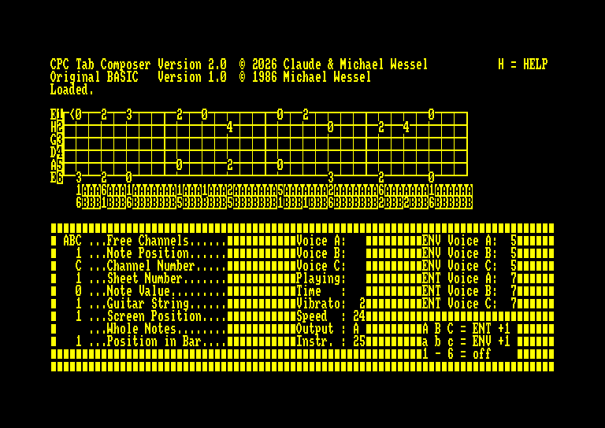
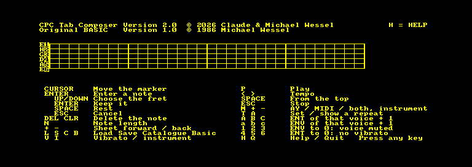

# tab-composer-cpc
The World's First (?) Tablature Composer Software - written in 1986 on an Amstrad CPC 464 

## Latest News

### 18-9-2026

**Forty years later, the original vision of Tab Composer CPC has been
realized.** The program I wanted to write in 1986 - in Z80 assembler, fast,
with MIDI - now exists. I didn't have the knowledge to pull that off as a
16 year old; Claude wrote it, and I directed and tested it.

Best of all, **you can now watch the tablature scroll past as the music
plays** - which is what I wanted the program for in the first place, back
when I was using it to help me through my guitar lessons.

That part was simply out of reach in 1986, and not for want of wanting it:
**it is only possible because the screen is written directly, byte by byte,
in Z80.** In BASIC a single page of the sheet took seconds to draw - you
cannot follow music with that, whatever you do. Claude got a full page down
to 0.16 s and a page turn to 0.093 s, inside the 0.24 s that one position
of the music lasts, by writing into screen memory rather than asking the
firmware: a character becomes eight stores 2048 bytes apart, a row of
identical blocks becomes one byte written eighty times, and only the cells
that actually changed are touched. The firmware costs about 1.7 ms *per
character*. Nothing in Locomotive BASIC could have closed that gap - this
is exactly the kind of machine level work I could not do at 16, and the
reason the idea had to wait forty years. See
[Forty Years Later](#forty-years-later-the-1986-vision-in-z80) below for the
program, the disc images, the source, and how it was built.



### 5-3-2026 

I have restored many of the **old songs** I made with Tab Composer CPC back in ~1986 from 40 year old cassette tapes! Check out [the YouTube video for the details.](https://youtu.be/yU8MmQVJ87o)

There is now a [DSK image for CPC emulators with the restored songs and a special version of Tab Composer CPC that can play back these older songs.](cpc/SONGS-TCX.dsk) Note that the songs were originally created with an earlier version of Tab Composer CPC, before I owned a DD1 disk drive. This older version (`tabcomp1.bas`) used a different data format and also  had the drawback of not allowing round trip editing of the songs once saved. This shortcoming was fixed in [the latest "official" version of `tabcomp.bas`](cpc/tabcomp.dsk). But most of the songs I had already created with the earlier version (`tablcomp1.bas`) - to read these back with the latest more capable version I hence added a data conversion routine to the song loader. This version is on [the song disk](cpc/SONGS-TCX.dsk): `tabcompx.bas` (`x` for conversion). So please use this version to load the songs included on the disk and not `tabcomp1.bas`. 

To use `tabcompx.bas` for loading a song and play it back, first use the `l` key to load the song. Just enter the filename *without the .mus extension.* You can see all the songs on disk with the cataloge function: `c`. To play back a song, use `p` and answer the questions ("Geschwindigkeit" = "Speed", use 50, 100, ..., depending on the song; the other input prompts should be understandable for English speakers). You can always get the help page with the `h` key. 

Note that loading songs with `tabcompx.bas` takes a bit longer than with `tabcomp1.bas` or  [the "official" Tablature Composer on the tabcomp.dsk image](cpc/tabcomp.dsk), due to the required data conversion. 

Moreover, I also retrieved [the very first *Version 0 of Tab Composer CPC*](cpc/TABCOMP0.dsk) from tape! This is a very primitive "first sketch of an idea" prototype version, so don't use it for anything - it is archived here for the sake of completeness and "just for fun". A few songs are also included for it on the disk - you can use the `6` on the number
pad, hit `SPACE`, enter song name (e.g., `wilsons's`), hit `j` for `LIED SPIELEN?`, use 50 for playback speed, etc. Enjoy! 


## Background & Purpose  

Having a keen interest in the history of computer music and music
composition software, I am researching what officially counts as the
**world's first tablature composer software.** 

Currently, the [Wikipedia page
https://en.wikipedia.org/wiki/Tablature_editor](https://en.wikipedia.org/wiki/Tablature_editor)
still lists "Tab Composer CPC" as the first such program (created in
1986), but the purpose of this Github repo and Wikipedia page entry is
to have a correct historical account - **so if you should know of any
earlier Tablature programs that fit the bill, please let me know, so
that the Wikipedia page can be corrected!**

This GitHub repo exists to provide evidence for the [claims
on the Wikipedia page.](https://en.wikipedia.org/wiki/Tablature_editor)



## Tab Composer CPC ("Tabulations Composer")

So here is my contender for "The World's First" such program -
"Tabulations Composer", written in 1986 on my [Amstrad CPC
464](https://en.wikipedia.org/wiki/Amstrad_CPC_464) in [Locomotive
BASIC 1.0](https://en.wikipedia.org/wiki/Locomotive_BASIC).  I
mainly wrote it to help me practice for my guitar lessons.



The [YT video](https://youtu.be/F6k4eq10DJg) demonstrates how to enter
a piece of music in tablature notation using the WYSIWYG graphical
editor, and also [music playback.](https://youtu.be/F6k4eq10DJg?t=537)
Playback uses the CPC's 3-voice polyphonic [GI AY-3-8912 sound
chip](https://en.wikipedia.org/wiki/General_Instrument_AY-3-8910),
which was ubiquitous and quite capable for the time.

Here you can find [the Locomotive BASIC program
sources](src/tabcomp.txt), as well as [a DSK image](cpc/tabcomp.dsk)
that you can run in [a CPC Emulator.](http://www.winape.net/)

I used this program myself to create the music for my BASIC games back
in the day, e.g., the [6 highly polyphonic songs in
"MANIC".](https://youtu.be/_FTJe2Av1iw)

### Development & Historical Context

I started the project in spring 1986 and didn't own a disc drive yet,
so first versions of this rather large BASIC program were developed on
a purley cassette-based CPC system. This definitely required a lot of
patience.

I worked on this program for months, and transcribed [dozens of songs
from my guitar tab](https://youtu.be/_FTJe2Av1iw) book with it.

In May 2026, I have restored many of the **old songs** I made with Tab Composer CPC back in ~1986 from 40 year old cassette tapes! Check out [the YouTube video for the details.](https://youtu.be/yU8MmQVJ87o) As a results of these efforts, there is now a [DSK image for CPC emulators with the restored songs and an included special version of Tab Composer CPC (`tabcompx.bas`)](cpc/SONGS-TCX.dsk) that can play load these older songs doing some data conversion. 

Guitar tablature creator software became available much later on the
PC AFAIK, and I had no inspiration for this program. I might have seen
[Chris Hülsbeck's 1986 "Sound Monitor
1.0"](https://www.c64-wiki.de/wiki/Soundmonitor) on the C64, which is
considered the first Sound Tracker program, but no Sound Tracker or
something remotely similar was available on the CPC at that time.

There were [other CPC music composition
programs](http://tacgr.emuunlim.com/interviews/daverogers.html)
available though (e.g., "The Music System" by Rainbird), some as early
as 1985 when the CPC 464 was released. However, these used standard
sheet music notation, not Tablature, and don't count as Sound Trackers
either.

### Publication Attempts 

It never got published - I made two attempts by sending it to the
editors of ["Happy
Computer"](https://archive.org/details/happycomputer-magazine), and
then to the [DMV Verlag](https://www.cpcwiki.eu/index.php/DMV), which
was the publisher of the premier CPC magazine in Germany back in the
day, ["Schneider CPC
International"](https://archive.org/search?query=subject%3A%22Schneider%2FAmstrad+CPC%2FPC+International%22). It
was rejected twice due to high complexity, poor documentation, and
being of interest to a limited readership / audience only. My publishing 
attempts probably started in September 1986,
and the latest letter of rejection arrived in February 1987 (from
DMV). [Here is the evidence.](evidence/dmv-letter-1.jpg)


[The documentation](evidence/) I wrote back in the day was a mess - I
didn't own a printer yet, and my handwriting was poor, so from that
point of view it is not surprising that the program got rejected.

I [succeeded in selling / publishing other type-in programs for both
the CPC and later the Amiga
though](https://www.michael-wessel.info/anniversary.html) and
eventually made enough money so that I could afford the CPC disk drive
as well as an Amiga 500 with 1084 monitor back in the day.

### Reflections 

Even 40 years later, this is still a usable piece of software, and you
can see that entering a piece of Tab music doesn't take long! With a
bit of practice, as you can see in [the
video,](https://youtu.be/F6k4eq10DJg) it only takes about 5 minutes
for the first part of the demonstrated Bach Minuet. 

I definitely paid some attention to usability aspects as well and went
through a number of iterations - you can see how different and primitive the
very first version [`tabcomp0.bas`](cpc/TABCOMP0.dsk) looks compared to the final 
"product" [`tabcomp.bas`](cpc/tabcomp.dsk), and
the intermediate version [`tabcomp1.bas`](cpc/SONGS-TCX.dsk) that did not 
allow to continue editing of the tablature after loading it back from tape. 

Correcting false notes is not very
convenient - the idea was that "content" should be protected 
from accidental deletions. A single left arrow key hence only deletes
the note immediately left to it, and does not go back further,
potentially deleting more stuff by accident (there was no
UNDO). Hence, the special "correction string" at the top was used to
manoeuvre the cursor back / to the left.  Definitely not very
convenient - I'd implement that differently today. However, note
correction is rarely needed anyway.

### The Evidence

My letter including the hand-written program documentation to, and
response from, the ["DMV
Verlag"](https://www.cpcwiki.eu/index.php/DMV) is presented in [the
`evidence/` folder.](evidence/)

The handwriting is now transcribed and translated in
[`evidence/TRANSCRIPTION.md`](evidence/TRANSCRIPTION.md), German first and
English after, so the documentation can be read without deciphering 1987
handwriting. Two things in it are worth pointing out:

- **DMV's reply is dated 16 February 1987** and is signed by the editor in
  chief of *Schneider CPC International* - a dated, third party record that the
  program existed and had been submitted by then.
- My covering letter offers them "die **überarbeitete** Version des
  Tabulations-Composers" - the *revised* version, so an earlier one already
  existed - and is signed "Michael Wessel, Schüler, 16 J."

The key list and the variable list in those pages match the program's own help
page and variable declarations, which is a further check that the letters and
the surviving code are the same program.

### An Independent Check of the "First Tablature Composer" Claim

Since this repository exists to support a claim on Wikipedia, I asked
[Claude](https://claude.com/claude-code) (Anthropic) to look for evidence
**against** it as well as for it, and to give its own verdict. The method is
written out below so that anyone can repeat it.

**What was searched.**

- The **complete archived run of *Schneider CPC International***, the magazine
  this program was submitted to: twenty monthly issues from March 1985 to
  October 1986 plus two Sonderhefte, downloaded from the Internet Archive and
  searched in full text.
- The release dates of the tablature editors that are usually named as the
  early ones.
- Guitar and music software for other home computers of the period, and
  academic work on computer tablature.
- The provenance of the sources that currently repeat the claim.

**What was found.**

- In those twenty months of *Schneider CPC International*, the word "Gitarre"
  **does not occur once**, in any spelling, and neither does "Tabulatur". The
  only near misses are "Tabulator", meaning a tab stop in a word processor, and
  two mentions of "Musiknoten", one of them a game. The OCR is sound: "Musik",
  "Programm", "Listing" and "Sound" all appear in all twenty-two issues. Guitar
  was simply not a subject in that magazine.
- Every tablature editor with a documented date is later, and not by a little:
  Wayne Cripps' lute `tab` is copyright **1991**, TablEdit's own release history
  gives **1997** for its first version, Guitar Pro is **1997**.
- Guitar software of the mid eighties on other machines was tuners and chord
  dictionaries - type in a chord name, see it on a fretboard - rather than
  anything you could compose with. Tablature shared on bulletin boards was
  plain text, not software.
- One genuine rival exists: a project at the University of Ottawa on the
  automated translation of 16th century lute tablatures, running **1985 to
  1990**, which built "a special tablature editor" for German, French and
  Italian lute tablature. It is a data entry tool feeding a transcription
  pipeline - no composition, no playback - and it is not dated more precisely
  than that five year window.
- **The online agreement is circular.** Every source that currently states
  "the first tablature program was written for the Amstrad CPC 464 in 1986"
  traces back to the Wikipedia entry this repository supports. It should not be
  cited as independent corroboration, and is not treated as such here.

**The verdict, as calibrated as it can honestly be.**

- **"The first tablature *composer*"** - a program for writing tablature
  interactively, with playback - **survives a deliberate attempt to refute it.**
  Nothing earlier was found, and nothing close.
- **"The first tablature *editor*"**, read broadly, is the weaker claim. The
  Ottawa lute editor may well be contemporaneous, and an editor for entering
  historical tablature is an editor. The narrower wording is the defensible one.
- This is **unrefuted, not independently corroborated**. Magazine type-in
  listings from 1983 to 1986 are badly indexed and largely invisible to
  searching, and that is exactly where a rival would hide. A single dated
  listing in some 1985 magazine would settle it the other way.

The strongest evidence remains the correspondence in
[`evidence/`](evidence/), [transcribed and translated
here](evidence/TRANSCRIPTION.md): a letter from the editor in chief of
*Schneider CPC International* **dated 16 February 1987**, replying to a
submission whose covering letter offers the *revised* version of the program.
That does not prove "first" - nothing can - but it does date the program
through a third party, which is what the claim needs most.

### Reading the Programs on the Disk Images

The BASIC programs on the disk images are stored tokenised, which is how
Locomotive BASIC saves unless you ask for `,A`. [`tools/debas.py`](tools/)
turns them back into a listing, so you can read them without a CPC or an
emulator:

```sh
iDSK cpc/SONGS-TCX.dsk -g TABCOMP1.BAS
python3 tools/debas.py TABCOMP1.BAS
```

It handles the AMSDOS header, string literals with embedded control codes
(the listings are full of `CHR$(24)` for inverse video), `|RSX` commands,
and the variable type suffixes, which are implied by `DEFINT a-y` rather
than stored. It was checked by detokenising `TAB-COMP.BAS` and comparing
it against [`src/tabcomp.txt`](src/tabcomp.txt), the listing transcribed
from the original: all 444 lines come back identical.

The listings it produces are in [`src/`](src/), so the programs can simply
be read here:

| Listing | Program |
| --- | --- |
| [`src/tabcomp0.txt`](src/tabcomp0.txt) | the 1986 prototype, Version 0 - one array per string (`e`, `a`, `d`, `g`, `h`, `he`) |
| [`src/tabcomp1.txt`](src/tabcomp1.txt) | the first real version, which stored the AY sound period per note and so could not be edited again after saving |
| [`src/tabcomp.txt`](src/tabcomp.txt) | the finished version: notes are stored as the tablature position itself, which is what made round trip editing work |
| [`src/tabcompx.txt`](src/tabcompx.txt) | the same, plus the routine that converts the old period based songs into the new format |

## Forty Years Later: the 1986 Vision in Z80

### The story

I got my Amstrad CPC 464 in April 1985, for my confirmation. I started
sketching what became Tab Composer CPC late that year, and the version I
still call the finished one dates from 1986. It did what I had set out to
do - I could write my guitar exercises down in tablature, see them on the
screen, and hear them played back on the AY.

But it was written in Locomotive BASIC, and that set one hard limit:
drawing a page of the sheet took seconds. Everything else follows from
that. You could not watch the music while it played, because the screen
could not keep up with it. And it could only ever drive the three voices of
the CPC's sound chip - MIDI came into my life much later.

Plenty of the rest was simply how a 16 year old designed it. Parameters
were typed at prompts because prompts were what I knew. Some of the
editing was awkward in ways I did not notice at the time. None of that was
BASIC's fault, and the rewrite was a chance to think about it again.

What I actually wanted was the same program in Z80 assembler: fast enough
that the screen kept up with me, and - once MIDI came into my life - able
to drive a synthesiser instead of only the AY. I never wrote it. At 16 I
did not have the knowledge to pull that off. Machine code was something I
read about in magazines; the gap between reading about it and writing five
thousand lines of it was not one I could close.

In September 2026 I sat down with Claude and we built it. I directed the
work, made the design calls, and tested every build - first in the
emulator, then on the real 6128 with the MIDI card. Claude wrote the Z80.
Almost exactly forty years after the BASIC version, the loop closes, and
the program I had in mind in 1986 exists.

### CPC Tab Composer 2.0



Everything the 1986 program did, minus two things I deliberately dropped -
cassette support and the noise channels - and with the things BASIC could
not do.

**The biggest change is one I had wanted from the very beginning: you can
now watch the music while it plays.** A marker moves along the sheet
position by position, the page turns by itself when the music leaves it,
and the panel shows what each voice is sounding at that moment. The 1986
version played a song perfectly well - but the sheet just sat there while
it did. You could hear the piece; you could not follow it.

That difference is not a nicety, it is what the program was for. I wrote
Tab Composer CPC in the first place to help me with my guitar lessons, and
a tablature you can *watch* as it plays is exactly what a learner needs:
you see which string and which fret is coming, you can slow it down with
`<` and `>` until your fingers keep up, and you play along. It turns the
program from something that writes music down into something that teaches
it - which is what I had in mind at 16, and could not build then.

It is also the single hardest thing in the port, and the reason so much of
the work below went into screen speed. Following the music means redrawing
while the music runs, and a page turn that takes a second and a half is not
following anything. It had to come down to 0.093 s, inside the 0.24 s a
position lasts, before the idea worked at all.

And the rest:

- **You hear the note you are choosing.** The 1986 version played
  `SOUND 130,100,10,15` while you picked a fret: one fixed click, the same
  pitch whichever fret you were on. Now the fret you are looking at is the
  note you hear, on the AY or over MIDI - which is the other half of using
  this to learn a piece.
- **MIDI OUT**, through the Ultimate MIDI Card from my
  [BluePillCPC project](https://github.com/lambdamikel/BluePillCPC), with a
  switch for AY, MIDI, or both - and a General MIDI instrument you can
  change while it plays. **The card is optional**: without it the program
  is exactly as it was, playing through the CPC's own sound chip, and only
  the MIDI setting of the `M` key needs hardware that is not in the
  machine.
- **Repeats you can see.** The jump is marked above the sheet and so is the
  place it jumps to, which the BASIC never showed.
- **No prompts for things that should be keys.** Tempo, vibrato, note
  length, envelopes and instrument are all single keys, and most of them
  work while the music plays.

### What else changed, and why

The screen is **in English**. The 1986 program was in German throughout -
"Freie Kanaele", "Notenblattnummer", "Wiederholung ab welcher Stelle" - and
that was fine for me, but this version is meant to be read by anyone who
finds the repo. The field widths were kept identical so the dotted columns
of the panel still line up: "Free Channels" is thirteen characters exactly
as "Freie Kanaele" was.

**Editing is a great deal more intuitive.** In 1986 the keys had grown
into odd habits - the left arrow deleted, `COPY` entered a note, `ENTER`
abandoned one, and a note once written could not be changed, only removed
and written again. Now the cursor keys move, `ENTER` enters and confirms,
`ESC` cancels, `DEL` deletes, and entering a note where one already sits
edits it. Those four keys do what they say everywhere in the program,
including in the prompts.

The rest are small things the 1986 design got stuck with, and every one of
them is a deliberate change rather than an oversight:

- **The Korrektursaite is gone.** In the 1986 version the left arrow
  *deleted* the note on the current string, so it could not also mean "go
  back" - and that is the entire reason the sheet had an extra row above
  the top string: somewhere harmless for the left arrow to mean "move". It
  never occurred to me to put delete on another key. `DEL` and `CLR` do it
  now, all four cursor keys simply move, and the extra row has nothing
  left to do.
- **`ENTER` enters a note**, where the BASIC used `COPY` - awkward to reach
  on a modern keyboard - and `ENTER` confusingly meant "give up on this
  note". `ENTER` starts it, `ENTER` keeps it, `ESC` abandons it. `COPY`
  still works, for 1986 fingers.
- **A note on a string that already has one is edited, not stacked.** The
  1986 version only asked "is this voice free?", never "is this string
  already taken here?", so you could put the same fret of the same string
  on all three channels at once - a chord no guitar can play, and no way to
  simply change a note you had already written. Notes on *different*
  strings at the same position are still a chord, of course.
- **A rest can be deleted.** Line 1370 compares the string digit of 88
  against rows that only go up to 6, so in 1986 a rest, once entered, was
  permanent.
- **A repeat can be deleted** - `T` then `0`, since positions start at 1.
  The BASIC had no way to take one back at all.
- **The sheet turns by itself** at either edge, instead of stopping to ask
  "Notenblatt korekt &lt;J&gt;&lt;N&gt;". `+` and `-` still move a whole sheet.
- **The catalogue comes up before the load prompt**, so you do not have to
  remember what the songs are called.
- **Messages wait to be read.** An error holds until a key is pressed, and
  the keyboard is emptied first - otherwise the keystroke still in the
  buffer from typing a filename takes the message away before you see it.
  AMSDOS is kept quiet while the disc is searched, so a missing file
  produces one message in one place rather than two in two.
- **Quitting asks first.** It throws the song away, and there is no way
  back from it.
- **Cassette and the noise channels are gone.** The BASIC could switch to
  tape (`K`, `D`, `G` for `|TAPE`, `|DISC` and `SPEED WRITE`); this is disc
  only. The noise periods went the same way - they were never useful for a
  guitar.

### What it needs

**A stock 64K CPC with a disc drive, and nothing else.** No memory
expansion: the program, the song, the font copy and AMSDOS's buffer all sit
inside the base 64K, and the second bank of a 6128 is never touched.

| | |
| --- | --- |
| CPC 464, 664 or 6128 | 64K is enough - tested on an emulated 464 with a DDI-1, loading and playing from disc |
| a disc drive | DDI-1, DD1, built in, or a floppy emulator - AMSDOS comes with the interface, and the program loads and saves through it |
| the Ultimate MIDI Card | **optional**, and only for the MIDI output setting |

The memory map, for anyone reading the source:

    #4000   code and text        ends around #6200
    #7000   notes and lengths    700 positions x 3 voices, x2
    #8100   the font copy        taken from the lower ROM at startup
    #9E00   AMSDOS's 2K buffer
    #C000   the screen

### Using it

`RUN"TABCOMP` and the sheet comes up. `H` shows the key list at any time:



| Key | |
| --- | --- |
| cursor keys | move the marker - all four, on any row |
| `ENTER` | enter a note: up/down pick the fret, `ENTER` keeps it, `SPACE` makes it a rest, `ESC` abandons it |
| `DEL` / `CLR` | delete the note on this string |
| `N` | note length: whole, half, quarter, eighth |
| `+` `-` | a sheet forward or back (32 positions to a sheet) |
| `T` / `A` | set a repeat / list them. `T` then `0` removes the one under the cursor |
| `L` `S` `C` | load, save, catalogue |
| `B` | write the song out as a BASIC program |
| `P` | play |
| `M` | AY, MIDI or both |
| `I` | the General MIDI instrument |
| `V`, `<` `>` | vibrato, tempo |
| `Q` | quit, with a confirmation |

While it plays: `<` `>` tempo, `+` `-` step the MIDI instrument, `A B C`
and `a b c` step the tone and amplitude envelope of that voice, `1`-`6`
switch one off, `SPACE` starts again, `ESC` stops.

Notes are stored as the tablature position itself - string and fret - which
is what lets one representation drive both the AY and MIDI. On the AY a
note is a period looked up in the table the BASIC already had; over MIDI it
is the open string plus the fret, and nothing else. Keeping the fingering
in the file rather than a tone period was the right decision in 1986 for a
reason that only showed up now.

`B` writes the song as a Locomotive BASIC program - `ENV`, `INPUT"Speed"`,
a `READ`/`DATA` loop and three `SOUND` statements - so a piece can be
played on any CPC with nothing else loaded, exactly as the 1986 version's
`.BAL` export did.

### Disc images

| | |
| --- | --- |
| [`hfe/tabcomp-all.hfe`](hfe/tabcomp-all.hfe) | the program and all eighteen restored songs - for a Gotek or HxC |
| [`hfe/tabcomp-1.hfe`](hfe/tabcomp-1.hfe) | the program and nine of them |
| [`hfe/tabcomp-2.hfe`](hfe/tabcomp-2.hfe) | the program and the other nine |
| [`cpc/tabcomp-all.dsk`](cpc/tabcomp-all.dsk) | the same three as DSK images, for emulators |

Every disc carries the program, so any of them boots on its own.

The eighteen songs are the 1986 originals restored from tape, and they are
in the older file layout - note/length pairs with no count at the front,
the note held as an AY period rather than a fingering. The loader reads
that layout as well as the one the program writes itself, and turns the
periods back into positions on the neck the way `tabcompx.bas` does: lowest
fret first, so the fingering comes back as it went in. Files the program
saves are written in the newer layout, so they load in the 1986 BASIC too.

### The source

[`z80/`](z80/) holds about 5,200 lines of Z80:

| | |
| --- | --- |
| [`z80/tabcomp.asm`](z80/tabcomp.asm) | the main loop, the screen layout, the panel |
| [`z80/screen.asm`](z80/screen.asm) | everything that writes to screen memory directly |
| [`z80/edit.asm`](z80/edit.asm) | note entry, editing and deletion |
| [`z80/play.asm`](z80/play.asm) | playback, envelopes, timing |
| [`z80/midi.asm`](z80/midi.asm) | MIDI OUT |
| [`z80/takt.asm`](z80/takt.asm) | repeats |
| [`z80/load.asm`](z80/load.asm) / [`z80/save.asm`](z80/save.asm) | the `.MUS` file, both layouts |
| [`z80/bal.asm`](z80/bal.asm) | the BASIC program generator |
| [`z80/PORT.md`](z80/PORT.md) | the porting notes, including every trap below |

### Building it

    cd z80
    ./build.sh          # assemble, and make a test disc with one song on it
    ./dist.sh           # rebuild all three DSK and HFE images from scratch

[rasm](http://rasm.wikidot.com/) assembles it, [iDSK](https://github.com/cpcsdk/idsk)
puts `TABCOMP.BIN` and the songs on a disc image, and
[the HxC command line tool](https://hxc2001.com/) converts that to HFE.
Both scripts find the tools on the `PATH`, or take them from the
environment:

    RASM=~/tools/rasm IDSK=~/tools/iDSK ./build.sh
    HXCFE=~/tools/hxcfe ./dist.sh

`dist.sh` is how the images in [`cpc/`](cpc/) and [`hfe/`](hfe/) were made:
it takes the eighteen songs straight out of
[`cpc/SONGS-TCX.dsk`](cpc/SONGS-TCX.dsk), the disc of pieces restored from
my 1986 tapes, and puts them on a disc with the program. Rebuilding gives
byte identical images.

One thing to know about rasm: it reports a failed assembly on stdout and
still exits 0, so `build.sh` looks for the line that says it wrote a binary
rather than trusting the exit code. Several hours went into testing a stale
binary before that was noticed.

The build asserts its own memory map, which is not decoration - see below.

Everything was tested in [MAME](https://www.mamedev.org/) before it went
near the real machine, and tested by *measurement* rather than by looking
at it: MAME's Lua interface drives the keyboard, reads the CPC's memory
while the program runs, taps the I/O ports, and records the audio. Sound in
particular was never believed without a recording - `z80/audible.sh` plays
a piece with the audio captured to a file and measures the energy at the
pitch the note should be, because counting sound chip writes proves
nothing: the mixer can have the tone switched off and the registers will
still look busy.

## Technical Challenges

### The program that played nothing

The first version drew its sheet, reported that the sound queue had
accepted every note, and made no sound at all. The sound chip was being
handed nine byte blocks that were not the blocks the program had written.

The cause is a CPC fact that is easy to read past: **the lower ROM shadows
RAM at `#0000-#3FFF` whenever the firmware pages it in**, which it does
inside its own routines and its interrupt handler. The program had been
assembled at `#1000`. The firmware's sound manager, running from the
interrupt, read the sound block at that address - and got ROM. Measured
with byte identical code: `#1000` and `#2000` silent, `#4000` and `#9000`
audible. Everything now lives at `#4000` and above.

The giveaway had been sitting in a trace for hours: "periods" of 197 and
213, which are `&C5 &D5`, `push bc` / `push de` - lower ROM opcodes.

### Fast screen updates

This is the part that makes the program feel like the one I wanted.

The firmware's `TXT OUTPUT` costs about **1.7 ms per character** on a
CPC. That number is the whole story of the BASIC version's sluggishness,
and it does not improve just because the caller is now assembler. A full
page of the sheet is 576 blanked cells plus the notes; the information
panel is another 880. Through the firmware that is one and a half seconds
for the sheet and nearly two for the panel.

MODE 2 is one bit per pixel, 640 across, and the screen is not linear:

    address = #C000 + (y AND 7) * 2048 + (y / 8) * 80 + x

with `y` the scanline and `x` the byte column, eight pixels to the byte.
Writing it directly is a different order of cost, and four tricks make it
cheap:

**A character is eight stores, with no address arithmetic between them.**
A character cell is eight scanlines, and the interleave blocks are eight
scanlines too - so across one cell `(y / 8) * 80 + x` never changes and
only the `(y AND 7) * 2048` term moves. Consecutive lines of a glyph are
therefore *exactly* 2048 bytes apart, which is `#0800`, which is "add 8 to
the high byte":

```z80
;; DE -> the cell's top line in screen memory, HL -> the glyph's 8 bytes,
;; C = #FF for inverse video or 0 for normal
dch1:
    ld a,(hl)                   ; the glyph byte
    xor c                       ; inverse video is the glyph, inverted
    ld (de),a                   ; straight into the screen
    inc hl
    ld a,d
    add a,8                     ; +2048: the next scanline of this cell
    ld d,a
    djnz dch1                   ; eight times
```

No recomputed addresses, no carry handling, no firmware. `LDIR` cannot do
this - the eight rows are not contiguous - but it does not need to.

**The glyphs come from the firmware's own font, copied out once.**
`TXT GET MATRIX` gives the address of a character's eight bytes, and for
the standard set that address is in the lower ROM, which the program
cannot read unless it asks. `KL L ROM ENABLE` at `&B906` pages it in for
the copy; after that a glyph is eight bytes at `FONT + character * 8`. (The
address was found by measurement, not from a manual: the byte at `#3A08`,
where the firmware says the letter A lives, reads `00` before that call and
`18` after - which is the apex of an A.)

**A row of identical characters is one byte repeated.** The information
panel's background is 880 cells of the same block. Every cell being the
same glyph means every scanline of a row is one byte written eighty times,
so the whole panel is 88 runs of 80 bytes instead of 880 firmware calls -
and a run of 80 unrolled stores costs about 13 T-states a byte.

**The row offset comes out of a table.** `(y / 8) * 80` started as a loop
of up to 24 additions, and it sits in the inner loop of every character
drawn - several hundred per page. A table of the 25 row offsets costs 50
bytes and removes it entirely.

Then two decisions about *what* to draw at all:

**Repair one cell, not the whole sheet.** Blanking the marker damages
exactly one character cell. The BASIC redraws all six strings after every
keypress - line 1520 ends in `GOTO 730`, "Saiten zeichnen" - which is six
512 pixel lines. Here `fixcell` puts back the eight bytes of grid that the
one damaged cell contained: the string line through it, and the bar line if
one runs down that column. A cursor move now costs nothing measurable.

**A page turn does not redraw the grid.** The grid is identical on every
page, so turning to the next 32 positions only has to take the old page's
marks off - clearing the three bar rows, and putting the grid back under
each cell that carried a digit - and draw the new page over the grid that
is already there.

Measured, on the 1/300 s clock the firmware maintains:

| | through the firmware | direct |
| --- | --- | --- |
| one character | ~1.7 ms | 8 stores |
| clearing the note sheet | 0.98 s | 0.04 s |
| a whole page | 1.58 s | 0.16 s |
| a page turn while playing | - | 0.093 s |
| the panel and all its labels | ~1.9 s | 0.187 s |
| a cursor move | 0.1 - 0.34 s | 8 bytes |

### Playing in time while the screen is busy

Once the display follows the music, every position has drawing to do, and
the page turn has a great deal. Two things keep that inaudible.

The first is that the **firmware sound queue is interrupt driven**. A note
is handed over with its duration and the sound manager sequences it from
the interrupt, so the AY plays on regardless of what the main code is
doing. The notes for a position are queued *before* any drawing for that
position.

The second is that **a position is timed against a clock, not counted out
in a delay loop**. A delay loop makes a position last its work *plus* the
delay, so the one position that redrew the page ran 160 ms long and the
music stumbled once a page - audibly. `KL TIME PLEASE` at `&BD0D` returns a
counter that ticks 300 times a second (measured: exactly 300 per second),
so each position waits until *its own* elapsed time is up and the drawing
happens inside the position it belongs to:

```z80
    call KL_TIME_PLEASE         ; when this position began
    ld (psstart),hl
    ...queue the three voices, then draw...
ps_wait:
    call KM_READ_CHAR           ; and keep the key, if there is one
    jr nc,psw2
    ld (pskey),a
psw2:
    call KL_TIME_PLEASE
    ld de,(psstart)
    or a
    sbc hl,de                   ; how long this position has lasted
    ld a,(speed)
    ld e,a
    ld d,0
    or a
    sbc hl,de
    jr c,ps_wait
```

Comparing *elapsed against the step* rather than the clock against a
deadline also means the 16 bit counter can wrap without anything going
wrong. Measured afterwards: every position exactly 72 ticks, the one that
turns the page included.

### MIDI, and a byte that takes 320 microseconds

MIDI output goes through the Ultimate MIDI Card from my
[BluePillCPC project](https://github.com/lambdamikel/BluePillCPC) - a card
on the CPC's expansion port, at `&FBEE`. It is optional hardware: with no
card fitted the program runs exactly as before on the AY, and only the MIDI
and AY+MIDI settings of the `M` key have nothing to talk to.

MIDI is 31250 baud, one start bit, eight data, one stop - so a byte owns
the wire for 320 us and nothing can go out faster, whatever the card's
buffer says. This was learned the hard way on the CPC TRACKER project,
where the first version sent bytes 98 us apart and the ones that got lost
were program changes; a channel that loses its program change stays on
General MIDI 1, Acoustic Grand Piano, and I heard piano on track 2 of a
song on the real machine. So the wait lives *inside* the send routine and
no caller can forget it. Measured on the wire here: 345 to 350 us between
bytes.

The whole MIDI layer is about 200 lines, because the tablature already
holds what MIDI wants:

```z80
;; the open strings as MIDI note numbers, high E first
midiopen: defb 0,64,59,55,50,45,40
;; a note is the open string plus the fret. That is the entire mapping.
```

What MIDI does need, and the AY does not, is to be told when a note ends:
the AY is handed a duration and looks after itself, so each voice here
counts down the positions its note has left and gets a Note Off when they
run out.

### Traps worth writing down

**The program grew into its own data.** Three times, a fixed address above
the program - the font table, the song data - was quietly overwritten as
the code grew past it, and every time the symptom looked like a drawing
bug: blank glyphs, a garbled panel, nonsense text. The fix is a build time
assertion, which is now in the source:

    assert tabend < NOTES
    assert tabend < FONT

**A nought that ate the next character.** The routine that prints a number
in three right aligned columns tested "the last digit always prints" with
`ld a,b / cp 1 / jr z,print` - and A no longer held the digit at that
point, it held B. So any number ending in zero printed `CHR$(1)`, which the
firmware reads as "print the next character literally": the nought vanished
*and* swallowed the character after it. A voice switched off kept showing
its old envelope number, and an empty field showed the panel pattern
through the hole.

**A firmware call does not preserve HL.** After a failed load the program
said so, waited for a key, and then fell into the path that reports
success - which printed again from whatever HL held after the firmware's
key call. It walked off into memory printing until it found a zero byte,
spraying characters across the screen and flashing the border with whatever
control codes it passed through. It looked like a crash and was a
fall through.

**AMSDOS talks to the screen.** A missing file makes AMSDOS print its own
message wherever the cursor happens to be, over the sheet or the string
names. It says that through the text VDU, so the VDU is switched off around
the disc calls - `TXT VDU DISABLE` at `&BB57`, `TXT VDU ENABLE` at `&BB54` -
and the program reports the outcome itself, in its own place. Direct screen
writing is unaffected by that switch, which is what makes it usable here.

**MAME never writes a `.dsk` back.** It opens the image read/write, the
emulated machine sees its own writes and `CAT` lists the new file - and the
host file is byte identical when MAME exits, silently. A disc write has to
be verified inside the machine: save, load it back, and read the load
buffer out of memory.
